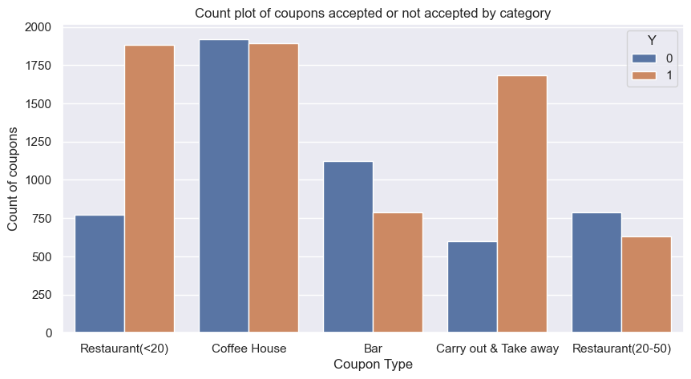
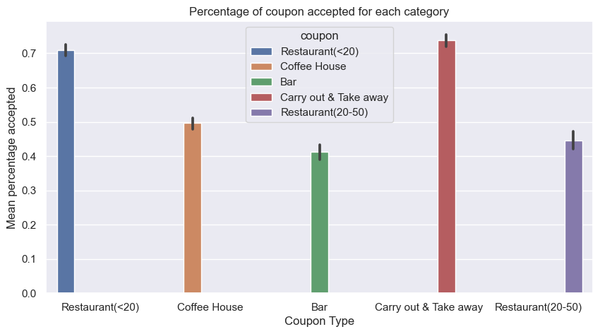
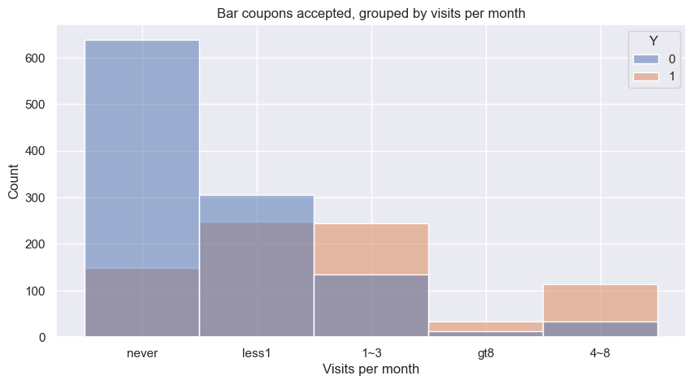
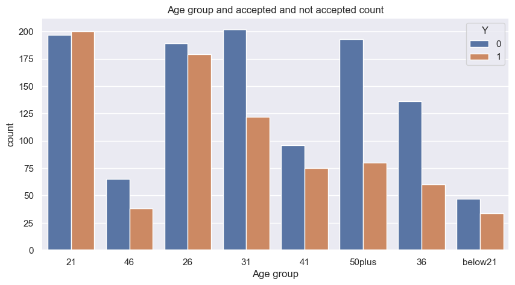
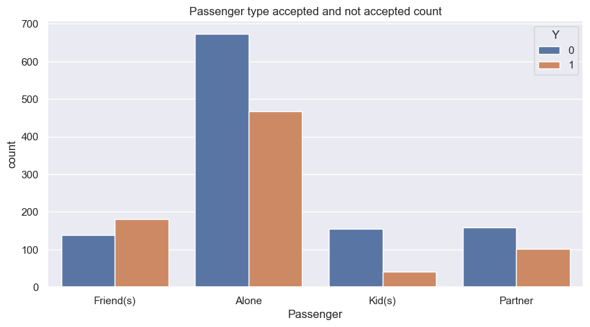
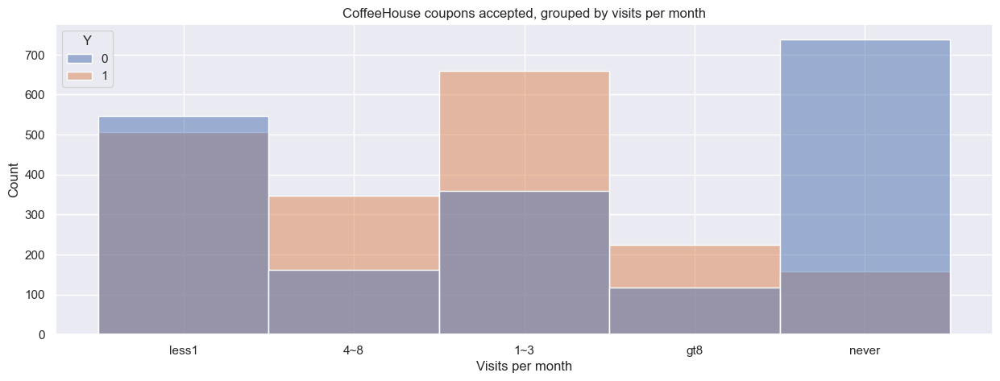
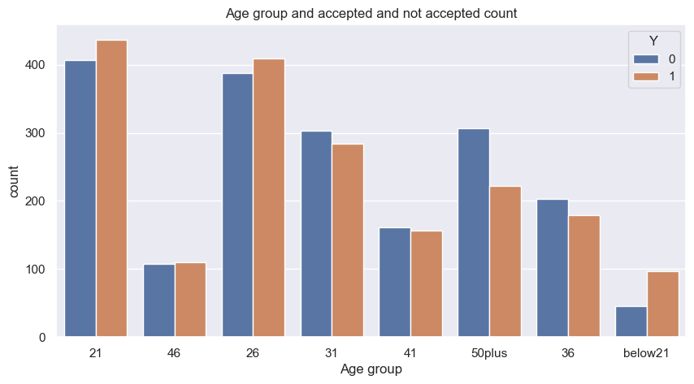
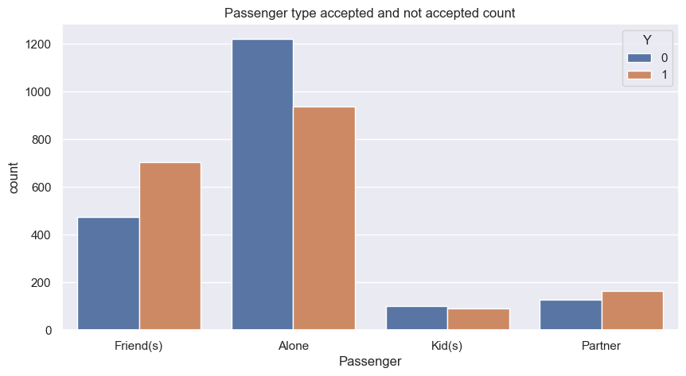

# papp1

## Background:
Will a Customer accept the Coupon?
The goal of this project is to explore visualizations and probability distributions to distinguish between customers who accepted a driving coupon versus those that did not. The data comes from the UCI Machine Learning repository and was collected via a survey on Amazon Mechanical Turk.

The provided data was analyzed with visualization and probability distribution for Bar coupon and independent analysis was done for CofeeHouse coupon. 

## Solution submission:
Prompt.ipynb - Contains responses to the question prompts and independent analysis

## Data Exploration:

### Data Info:
Provided coupon.csv data has 12684 and total of 26 columns.

### Missing Data:
As first step the data was analyzed for missing values and nans. Missing data are summarized below.

car                     12576
Bar                       107
CoffeeHouse               217
CarryAway                 151
RestaurantLessThan20      130
Restaurant20To50          189

## Data cleaning:

- Car column was dropped as majority of them are missing  
- After removing the Car column, remaining NANs were dropped
- Percent of missing data 4.769
- The cleaned ata was then left with 12079 entries

## Data Analysis:

What proportion of the total observations chose to accept the coupon? 
- About 56.93 percent accepted the coupon

### Summary of analysis for Bar coupon:

- About 41.19% accepted the Bar coupons
- Acceptance rate who went to bar three or fewer times a month = 37.26
- Acceptance rate who went to bar more than three times a month = 76.16
- Acceptance rate of drivers who go to a bar more than once a month and are over the age of 25 = 68.98
- Acceptance rate of drivers who go to a bar more than once a month and are under the age of 25 = 67.45
- There is slight difference, with people over the age of 25 going more
- Acceptance rate of drivers who go to bars more than once a month and had passengers that were not a kid and had occupations other than farming, fishing, or forestry = 70.94 

### Summary of analysis for Coffee House coupon:

- About 41.19 percent of people accepted Coffee house coupons
- Acceptance rate for those who went to a coffee house 3 or fewer times = 44.590
- Acceptance rate for those who went to a coffee house more than 3 times = 67.25
- Acceptance rate of drivers who go to a coffehouse more than once a month and are over the age of 25 : 63.95 percent
- Acceptance rate of drivers who go to a coffeehouse more than once a month and are under the age of 25: 70.83 percent
- Acceptance rate of drivers who go to coffeehouse more than once a month and had passengers that were not a kid and had occupations other than farming, fishing, or forestry: 65.96 percent

## Next Steps:
As per CRISP-DM, the next step would be to apply modeling techniques on the data, to cofirm the analysis done and feedback into exploration and analysis process if needed.